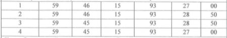

# OCR Coordinates to Geometry

QGIS 4 plugin for converting screenshots of coordinate tables into numbered
corner points, a line, and optionally a polygon.



The first supported table layout is:

```text
Point | Lat deg | Lat min | Lat sec | Lon deg | Lon min | Lon sec
```

Example: `1 | 59 | 46 | 15 | 93 | 27 | 00`.

## Features

- Open PNG/JPG screenshots or paste an image from the clipboard.
- OCR through RapidOCR.
- Editable recognition preview.
- Add and delete table rows before creating geometry.
- DMS to decimal-degree conversion.
- Point layer with vertex numbers.
- Line layer in point-number order.
- **Close line** option repeats the first vertex as the last vertex.
- Optional polygon layer.
- Output in EPSG:4326, ready for on-the-fly transformation by QGIS.

## QGIS compatibility

- QGIS 4.0–4.99
- Windows 10 and Windows 11

QGIS 4 moved to Qt 6. The plugin uses imports from `qgis.PyQt` and scoped Qt
enums.

## Install from ZIP

1. Download `ocr_coordinates_to_geometry.zip` from Releases.
2. In QGIS open **Plugins → Manage and Install Plugins → Install from ZIP**.
3. Select the ZIP and confirm installation.
4. Start **OCR Coordinates to Geometry** from the Plugins menu or toolbar.

## OCR dependency

The UI and geometry engine work without third-party packages, but automatic
image recognition needs RapidOCR and ONNX Runtime in the Python environment
used by QGIS:

Open **OSGeo4W Shell** installed with QGIS and run:

```bat
python-qgis.bat -m pip install rapidocr onnxruntime
```

Then restart QGIS. If `python-qgis.bat` is unavailable in your installation,
run the same command with the full QGIS Python executable. See
[`docs/WINDOWS_OCR_SETUP_RU.md`](docs/WINDOWS_OCR_SETUP_RU.md) for the exact
Windows 10/11 steps and troubleshooting.

The plugin reports a clear installation message when the packages are absent.
No image or coordinates are uploaded to an external service.

## Development

Run dependency-free unit tests from the repository root:

```bash
python -m unittest discover -s tests -v
```

Build an installable ZIP:

```bash
python scripts/build_zip.py
```

## Status

Version 0.1.0 is an MVP. It targets clean tables with seven numeric columns.
More screenshots are needed to tune cell detection and OCR normalization for
different scans and document templates.

## License

MIT
