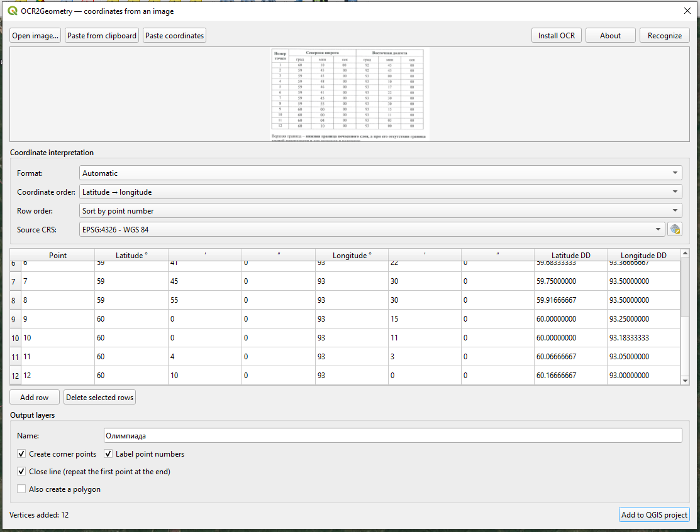
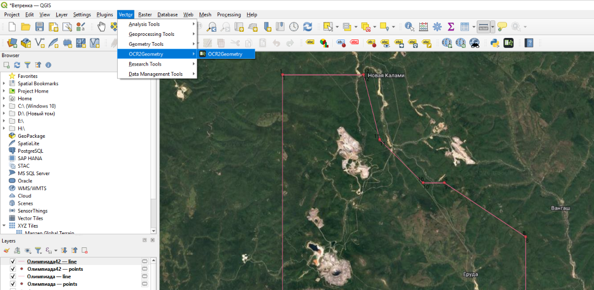

# OCR Coordinates to Geometry

[Русский](README_RU.md) · **English**


Turn a screenshot of a coordinate table into numbered points, a line and an
optional polygon directly in QGIS.



*OCR2Geometry v0.5.0 in QGIS 4 with source CRS and output-layer naming.*

## Why this plugin exists

Mining licences, land-allocation documents and legacy survey reports often
contain corner coordinates only as scanned tables. The traditional workflow is
OCR → spreadsheet cleanup → CSV import → point sorting → polygon creation.
This plugin reduces that workflow to a screenshot, a review table and one
button.

## Current features — v0.6.3

- Open PNG/JPG images or paste a screenshot from the clipboard.
- Offline recognition with RapidOCR.
- One-click OCR dependency installation inside the QGIS user profile.
- Editable seven-column DMS preview.
- Validation of degrees, minutes, seconds and point numbers.
- Numbered corner-point layer.
- Open or closed line in point-number order.
- Optional polygon layer.
- Source CRS selection from the standard QGIS catalog (EPSG:4326 by default).
- Custom base names for output layers.
- No image or coordinate upload to external services.
- English and Russian interface selected from the QGIS locale.
- OCR2Geometry icon, diagnostics and persistent user options.
- Automatic DMS, degrees/decimal-minutes and decimal-degree parsing.
- Latitude/longitude reversal, N/S/E/W hemispheres and signed coordinates.
- Plain-text coordinate paste and source-order controls.
- Live decimal-degree preview columns.
- Pre-creation coordinate and geometry quality review.
- Missing point-number, coincident-vertex and invalid-polygon warnings.
- CRS-aware line length, perimeter and area calculation.
- Green, yellow and red OCR-confidence highlighting with percentage tooltips.
- CSV export of the reviewed table with DMS, decimal coordinates and OCR confidence.
- Spreadsheet-style manual entry with Excel paste and live two-way DMS/DD conversion.
- Configurable second precision from 0 to 6 decimal places (3 by default).

Supported input layout:

```text
Point | Lat deg | Lat min | Lat sec | Lon deg | Lon min | Lon sec
```

## Install

1. Download [`ocr_coordinates_to_geometry.zip`](dist/ocr_coordinates_to_geometry.zip).
2. In QGIS open **Plugins → Manage and Install Plugins → Install from ZIP**.
3. Select the downloaded ZIP and start the plugin.
4. On first recognition, allow the plugin to install RapidOCR. Internet access
   is needed only for this initial dependency download.

Compatibility: QGIS 4.0–4.99, Windows 10 and Windows 11.

## Basic workflow

1. Start the plugin from **Vector → OCR2Geometry → OCR2Geometry** or its toolbar icon.
2. Open or paste a coordinate-table image, then click **Recognize**.
3. Review the recognized rows and choose the source CRS.
4. Enter a base name and select the required point, line and polygon outputs.
5. Click **Add to QGIS project** and verify the geometry against the source document.



The selected name is supplemented with separate **points**, **line** and
**polygon** suffixes. The selected CRS is assigned to the layers; use standard
QGIS tools when reprojection is required.

## Planned development

Version 0.5 adds source CRS selection through the standard QGIS catalog
and custom output-layer names. Coordinate transformations remain a standard
QGIS responsibility. Future releases focus on quality control, PDF/batch
processing and more UI languages.

See the complete [development roadmap](ROADMAP.md). Planned items are not yet
available in the current release.

## Accuracy and CRS warning

Always review recognized values before using the geometry and select the CRS
that describes the source coordinates. Assigning a CRS does not transform the
numbers. Use QGIS export/reprojection tools for coordinate transformations.

## Development

```bash
python -m unittest discover -s tests -v
python scripts/build_zip.py
```

Bug reports, real-world sample layouts and pull requests are welcome. Please
read [CONTRIBUTING.md](CONTRIBUTING.md) before sharing documents.

## Project documents

- [Roadmap](ROADMAP.md)
- [Changelog](CHANGELOG.md)
- [Windows OCR setup](docs/WINDOWS_OCR_SETUP_RU.md)
- [Contributing](CONTRIBUTING.md)
- [Russian README](README_RU.md)

## License

MIT. RapidOCR and its OCR models have their own licences; see the upstream
[RapidOCR project](https://github.com/RapidAI/RapidOCR).

## Developers

- Markseder
- Matveev Pavel — <pavelmatveev84@gmail.com>
