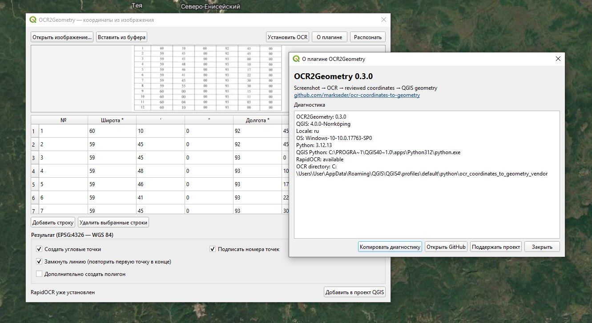

# OCR Coordinates to Geometry

[Русский](README_RU.md) · **English**


Turn a screenshot of a coordinate table into numbered points, a line and an
optional polygon directly in QGIS.



*OCR2Geometry v0.3.0 on QGIS 4.0.0 with local RapidOCR diagnostics.*

## Why this plugin exists

Mining licences, land-allocation documents and legacy survey reports often
contain corner coordinates only as scanned tables. The traditional workflow is
OCR → spreadsheet cleanup → CSV import → point sorting → polygon creation.
This plugin reduces that workflow to a screenshot, a review table and one
button.

## Current features — v0.3.0

- Open PNG/JPG images or paste a screenshot from the clipboard.
- Offline recognition with RapidOCR.
- One-click OCR dependency installation inside the QGIS user profile.
- Editable seven-column DMS preview.
- Validation of degrees, minutes, seconds and point numbers.
- Numbered corner-point layer.
- Open or closed line in point-number order.
- Optional polygon layer.
- EPSG:4326 output.
- No image or coordinate upload to external services.
- English and Russian interface selected from the QGIS locale.
- OCR2Geometry icon, diagnostics and persistent user options.

Supported input layout:

```text
Point | Lat deg | Lat min | Lat sec | Lon deg | Lon min | Lon sec
```

## Install

1. Download [`ocr_coordinates_to_geometry.zip`](dist/ocr_coordinates_to_geometry.zip).
2. In QGIS open **Plugins → Manage and Install Plugins → Install from ZIP**.
3. Select the downloaded ZIP and start the plugin.
4. On first recognition, allow the plugin to install RapidOCR. Internet access
   is needed only for this initial dependency download.

Compatibility: QGIS 4.0–4.99, Windows 10 and Windows 11.

## Planned development

The next releases will add coordinate-order reversal, decimal formats,
N/S/E/W hemispheres, CRS selection, GSK-2011, SK-42 / Pulkovo 1942, SK-95,
Gauss–Krüger workflows, quality control, PDF/batch processing and more UI
languages.

See the complete [development roadmap](ROADMAP.md). Planned items are not yet
available in the current release.

## Accuracy and CRS warning

Always review recognized values before using the geometry. Datum transformations
must use parameters appropriate to the source document and region. The plugin
will never silently guess a local transformation where several valid choices
exist.

## Development

```bash
python -m unittest discover -s tests -v
python scripts/build_zip.py
```

Bug reports, real-world sample layouts and pull requests are welcome. Please
read [CONTRIBUTING.md](CONTRIBUTING.md) before sharing documents.

## Project documents

- [Roadmap](ROADMAP.md)
- [Changelog](CHANGELOG.md)
- [Windows OCR setup](docs/WINDOWS_OCR_SETUP_RU.md)
- [Contributing](CONTRIBUTING.md)
- [Russian README](README_RU.md)

## License

MIT. RapidOCR and its OCR models have their own licences; see the upstream
[RapidOCR project](https://github.com/RapidAI/RapidOCR).
